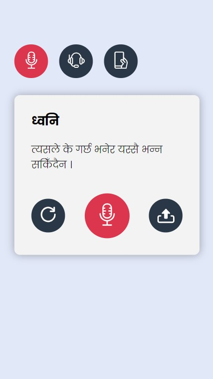

# Prototype of a ASR data crowdsourcing application

I'll use thing to record tons of audio, rate the quality of audio recordings, and use the audio recordings to train an ASR system.

[niravko](https://niravko.com/)
